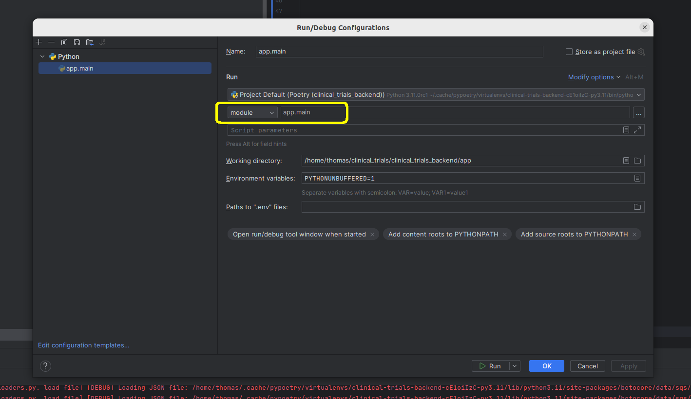

<a href="https://fastdatascience.com"><span align="left">🌐 fastdatascience.com</span></a>
<a href="https://www.linkedin.com/company/fastdatascience/"></a>
<a href="https://twitter.com/fastdatascienc1"></a>
<a href="https://www.instagram.com/fastdatascience/"></a>
<a href="https://www.facebook.com/fastdatascienceltd"></a>
<a href="https://www.youtube.com/channel/UCLPrDH7SoRT55F6i50xMg5g"></a>
<a href="https://g.page/fast-data-science"></a>
<a href="https://medium.com/fast-data-science"></a>
<a href="https://mastodon.social/@fastdatascience"></a>

# Fast Clinical NLP Back end

[](https://github.com/fastdatascience/clinical_trial_risk_v2_public/tree/main/src/back_end/actions/workflows/deploy-prod-to-azure.yml)

[](https://github.com/fastdatascience/clinical_trial_risk_v2_public/tree/main/src/back_end/actions/workflows/deploy-dev-to-azure.yml)

## Where is it running?

* Development API: https://ct-api-dev.fastdatascience.com/docs
* Production API: https://ct-api-prod.fastdatascience.com/docs

## See also

* Core Python library <https://github.com/fastdatascience/clinical_trial_risk_v2_public/tree/main/src/back_end/clinical_trials_core>
* Front end <https://github.com/fastdatascience/clinical_trial_risk_v2_public/tree/main/src/front_end>

## Built with

[](https://python.org) [](https://fastapi.tiangolo.com/)  [](https://python-poetry.org/)

## How to run the server

1. Drop into the venv by running `poetry shell`
2. Install dependencies by running `poetry install`
3. Start job queue `rq worker --with-scheduler`
4. Run it using the command below

``` bash
λ make run
```

Api docs can be found [here](http://0.0.0.0:5000/docs).

## Requirements

* Poetry 1.8.5
* Python 3.11
* Java 17
* Redis

## Installing requirements

Install Java:

``` bash
sudo apt install openjdk-17-jdk openjdk-17-jre
```

Install [poetry](https://python-poetry.org/docs/#installing-with-pipx). You may need to install `pipx` first:

``` bash
pipx install poetry
```

## Making the requirements.txt and running in venv as an alternative to Poetry

``` bash
poetry export -f requirements.txt --output requirements.txt
```

Run

```
python -m venv venv
source venv/bin/activate
```

You also need the `.venv` file

``` bash
make run
```

## Running (and debugging) the API in Pycharm

You can run the API using `app.main` as an entry point:

``` bash
python -m app.main
```

In Pycharm, you can achieve this by creating a run configuration of type `module`:



## Installing and running redis

For development context it is recommended to use docker image of redis. You can use the following command to pull the
redis image.

``` bash
docker pull redis:7.2-alpine
```

After pulling the image start the redis instance.

``` bash
docker run --rm -p 6379:6379 -it redis:7.2-alpine
```

## Run with Docker

The steps described here are useful if you want to run the tool locally with Docker, check `docs/DOCKER_DEPLOYMENT.md`
for more information on how to deploy the tool with Docker on a server (the tool deployed in production is not deployed
with Docker at the moment).

Before starting, make sure the ports below are free on the host machine. These ports are mapped on the container to
the host machine.

- `Clinical Trials back-end`: 5000
- `PostgreSQL`: 5432
- `Redis`: 6379
- `Tika gRPC`: 8888

Follow the steps below to easily run the application with Docker.

### 1. Clone the repo

```bash
cd ~
git clone --recurse-submodules https://github.com/fastdatascience/clinical_trial_risk_v2_public/tree/main/src/back_end
```

To make sure you have the latest version of the submodule:

```bash
cd ~/clinical_trials_backend
git submodule update --remote
```

### 2. Environment variables

Copy the file`.env.example` to `.env`. Keep the environment variables for `PostgreSQL`, `Tika gRPC` and `Redis` as they
are in the file. These contain the default values used by Docker for these services. You may configure the other
environment variables as needed. After the containers were created, you can change the database user's password if
needed.

### 3. Containers

#### 3.1 Build and start containers

The command below will build, (re)create, attach services to containers, and finally start all containers. The
application will be accessible at ` http://127.0.0.1:5000`.

Run a production server:

```bash
docker compose up
```

Or run a development server:

```bash
docker compose -f docker-compose.yml -f docker-compose-dev.yml up
```

#### 3.2 Stop containers

The command below still stop all running containers.

```bash
docker compose stop
```

#### 3.3 Start containers

The command below will start all containers.

```bash
docker compose start
```

#### 3.4 Remove containers

The command below still stop and remove all containers (also networks).
Optionally, you can add `--volumes` to remove the volumes as well.

```bash
docker compose down
```

## GitHub Actions

### Run actions locally

To run actions locally, you can use `https://github.com/nektos/act`.

Install act:

```bash
curl https://raw.githubusercontent.com/nektos/act/master/install.sh | sudo bash
```

Copy the file `.secrets.example` to `.secrets.` and configure the environment variables.

*Note: To use the key `AZURE_KEY_DEV` or the key `AZURE_KEY_PROD`, you need to paste the private key in one line (remove
all new lines), and make sure it is inside double quotes.*

You may be asked to choose between the `Micro Docker Image`, the `Medium Docker Image` or the `Large Docker Image` when
running an action for the first time. Select the `Medium Docker Image`.

To run job with name `test`:

```bash
act -j test
```

### Run actions on GitHub

Make sure the secrets from `.secrets.example` are configured in the repository secrets.

Workflows will run when new commits are pushed to the branches `dev` or `main`.

## Server

#### SSH

Development server SSH access:

```
ssh azureuser@ct-api-dev.fastdatascience.com
```

Production server SSH access:

```
ssh azureuser@ct-api-prod.fastdatascience.com
```

#### Deployment

Check `docs/DEPLOYMENT.md` for more information on server deployment.

## Alembic

Alembic is used for database schema migrations. The database configured in the environment variables will be used.

**It is best to only apply changes such as adding a new table or field etc. These are changes that do not break the
currently deployed application. If you must delete a table or field, make sure that the table or field is not in use
anymore in the currently deployed application at the moment of creating the migration script.**

To check if migrations need to be generated:

```bash
alembic check
```

### 1.1 Create migration script

Make sure the database is up to date with the latest migrations:

```bash
alembic upgrade heads
```

To create a new migration script (e.g. if a new SQLAlchemy model was added):

```bash
alembic revision --autogenerate -m "Added new table"
```

Alembic will compare the database schema with the SQLAlchemy models.

You can find the new migration script under `migrations/versions`. You may edit the script if needed, for example if
you added a new column that has `NOT NULL` to a table with existing rows, you should add a default value for the column
in the script before applying the migration.

The new migration script should be added to the version control. The migration script will be applied to the database
during the CI/CD process. You should only apply the migration manually on your local database.

### 1.2 Apply migration

To apply the new migration to the database:

```bash
alembic upgrade head
```

### 1.3 Revert migration

To revert the migration:

```bash
alembic downgrade -1
```
