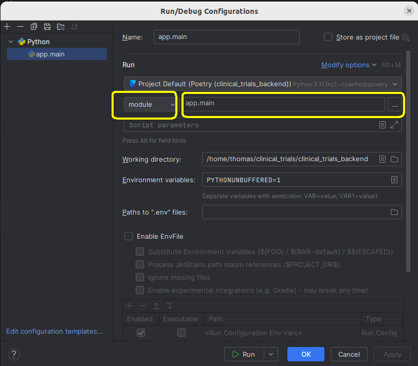

# How to install and run the entire Clinical Trial Risk Tool (front end + back end etc)

How to run entire stack locally

## Make sure you clone with submodules

First, clone the API and make sure to clone with `--recurse-submodules`.

```
git clone --recurse-submodules git@github.com:fastdatascience/clinical_trials_backend.git
```

## Environment variables

You need to make a file called `.env` with credentials for the database etc. Redacted credentials example below:

```
JWT_SECRET_KEY=

POSTGRES_HOST=
POSTGRES_PORT=
POSTGRES_USER=
POSTGRES_PASSWORD=
POSTGRES_DB=

GRPC_HOST=
GRPC_PORT=

REDIS_HOST=
REDIS_PORT=

MAIL_SMTP_HOSTNAME=
MAIL_SMTP_USERNAME=
MAIL_SMTP_PASSWORD=
MAIL_SMTP_PORT=

STORAGE_PROVIDER=

AWS_ACCESS_KEY=
AWS_SECRET_ACCESS_KEY=

AZURE_CONNECTION_STRING=

BUCKET_OR_CONTAINER_NAME=
CDN_BUCKET_OR_CONTAINER_BASE_PATH=

CLIENT_URL=

GOOGLE_CLIENT_ID=
GOOGLE_CLIENT_SECRET=
GOOGLE_REDIRECT_URI=
```

## Installation

Install Celery

```
sudo apt-get install celery
```

## 1. Run tika

In backend folder (https://github.com/fastdatascience/clinical_trial_risk_v2_public/tree/main/src/back_end), run Tika:

```
make run_tika_dev
```

## 2. Run Redis

``` bash
docker pull redis:7.2-alpine
```

After pulling the image start the redis instance.

``` bash
docker run --rm -p 6379:6379 -it redis:7.2-alpine
```

This will run Redis on `localhost:6379`

## 3. Run Celery from inside `clinical_trials_backend` folder

```
celery -b "redis://localhost:6379" -A app.ct_core worker --concurrency=10 -l info
```

## 4. run Python in backend folder

```
python -m app.main
```

This will run the API on `http://127.0.0.1:8000`

## 5. Run the front end

In front end repo, run

```
npm run dev
```

This will run the front end on `http://localhost:5173/`

## Troubleshooting

If you get AWS authentication errors, check that there are no credentials in your profile and reset them all to empty
before running Celery and API.

```
unset AWS_ACCESS_KEY_ID
unset AWS_SECRET_ACCESS_KEY
unset AWS_DEFAULT_REGION
unset AWS_ACCOUNT_ID
```

## Running in Pycharm

You can make a new run configuration of type `module` with value `app.main`. Make sure to run with the working directory
set to the base directory of this repo.




## Restarting the server

If the server becomes unresponsive or the queues get jammed, you can SSH into the server and restart everything:

```
ssh azureuser@ct-api-prod.fastdatascience.com
pm2 restart all
```
